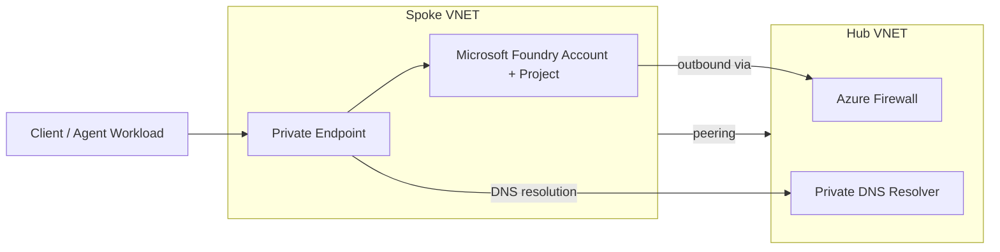

# Reference Architecture — AI Landing Zone + Foundry Networking

Used in the session's connectivity-patterns and identity blocks. Mirrors the `network-isolated-foundry` and `hub-spoke-foundry` templates under [`../bicep/`](../bicep/).

**Trust boundaries:** client workloads only reach Foundry through the private endpoint; all outbound calls from Foundry (e.g., to grounding data sources) are routed through the hub firewall; DNS resolution for `privatelink.*` names is handled centrally in the hub.
